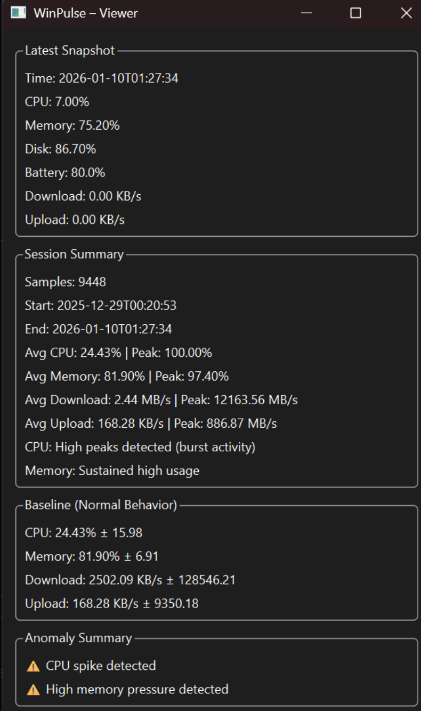

# WinPulse
WinPulse is a lightweight Windows system monitoring tool that collects real system metrics, learns baseline behavior for a specific machine, detects anomalies, and presents insights through a clean, read-only GUI.

It is designed to be low-overhead, honest, and useful, not a flashy dashboard that lies with smooth graphs.  

\### ✨ Key Features

#### 📊 System Monitoring

  CPU usage

  Memory usage

  Disk usage

  Battery status

  Network download & upload throughput (no speed tests)

#### 🧠 Baseline Learning

  Learns what “normal” looks like for your system

  Uses statistical mean ± standard deviation

  Adapts naturally to real usage (coding, gaming, idle)

#### 🚨 Anomaly Detection

  Detects sustained abnormal behavior

  Suppresses short spikes and noise

  Flags CPU spikes, memory pressure, and unusual network activity

#### 💾 Persistent Telemetry

  Stores metrics in SQLite

  Enables long-running analysis

  Survives restarts and long uptimes

#### 🖼️ Read-Only GUI (PyQt6)

  Latest system snapshot

  Session summary (avg & peak metrics)

  Baseline (normal behavior)

  Anomaly summary with contextual explanations

#### 🎯 Design Goals

  Lightweight
    -Samples every 10 seconds with negligible CPU, RAM, and disk usage.

  Honest Metrics
   -No artificial smoothing. No fake “speed tests”. No misleading charts.

  Clear Separation of Concerns

  Backend: data collection, logic, analysis

  GUI: visualization only (no computation)

  Noise-Resistant
   -Uses sustained deviation detection instead of reacting to single spikes.  
   

### 🖥️ GUI Preview

The GUI includes:

Latest Snapshot – current system state

Session Summary – aggregated metrics over time

Baseline View – learned normal behavior

Anomaly Summary – detected deviations with explanations

(GUI is intentionally read-only to preserve backend stability.)

Requirements

Python 3.9+

Windows OS

Install Dependencies
pip install psutil PyQt6

Run Backend (Monitoring)
python backend/main.py

Run GUI Viewer
python gui/app.py

🧪 Example Use Cases

Monitor long gaming or coding sessions

Understand real memory pressure over time

Detect unusual background network activity

Learn system behavior under real workloads

Lightweight alternative to heavy monitoring tools

📌 Limitations (By Design)

No real-time graphs (yet)

No background tray service

No automatic alerts

No cloud syncing

These are intentional to keep WinPulse lightweight and transparent.

🛣️ Planned Improvements

Manual refresh in GUI

Session reset markers

On-demand historical graphs

Optional tray mode

Cross-platform support (future)

🧠 Why WinPulse?

Most system monitors either:

Consume significant resources, or

Obscure reality with overly smoothed visuals

WinPulse focuses on:

Understanding system behavior, not just displaying numbers.

📄 License

MIT License
